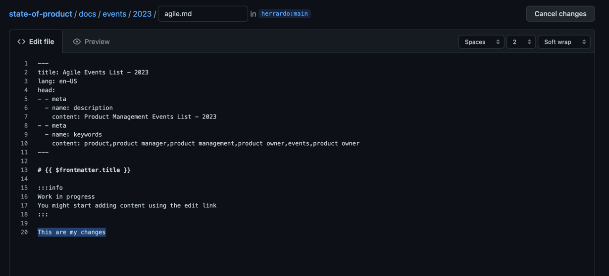
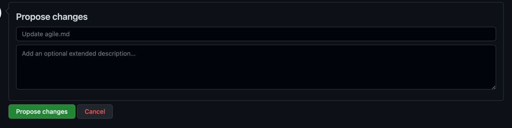
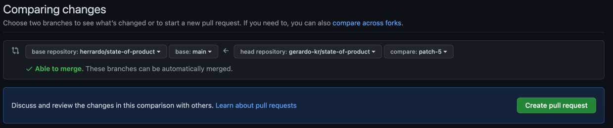
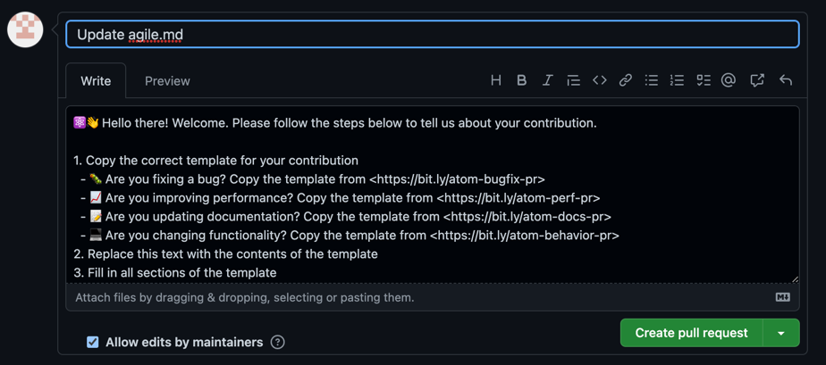

# Contributing Guidelines

We are really excited that you want to contribute to State of the Product
Website.

To make it easier for everyone, we’ve put together a set of **guidelines for
contributing to the State of the Product**, which is deployed in the
[State of the Product](https://herrardo.github.io/state-of-product/) with Github
Pages.

Don’t take these guidelines as hard and fast rules. Use your **best judgment**.

And above all, a heartfelt **thank you** for making the time to contribute.
We’re delighted to have you alongside!

---

#### Table of Contents

- [Code of Conduct](#code-of-conduct)
- [What you need to know before getting started](#what-you-need-to-know-before-getting-started)
- [How to contribute](#how-to-contribute)

  - [Suggest enhancements](#suggest-new-features-enhancements-or-documentation)
  - [Contribute code for the first time](#contribute-code-for-the-first-time)
  - [Report bugs](#report-bugs)
  - [Set up your development environment](#set-up-your-development-environment)

- [License](#license)

## Code of Conduct

This project and everyone who participates in it is governed by the
[State of the Product Code of Conduct](CODE_OF_CONDUCT.md). By participating,
you are expected to adhere to this code.

## What you need to know before getting started

State of the Product is a website that intends to be a collective source of
knowledge for the Product Management career. As you may see, there are different
sections, and you can contribute adding info to any of the sections, or even
suggest creating new ones to hold information that you might find valuable for
the community

Also, you may propose new styles for the information that is already in place.
For that, take into account that this site is build in VitePress, and you may
use any standard component in Markdown.

## How to contribute

### Suggest new features, enhancements or documentation

We’d love to hear your suggestions for State of The Product website, whether
they are completely new features or minor improvements to existing
functionality.

Also, if you would like to add a specific content:

- New Events
- New books
- New courses
- Etc

but you don't know how to create a Pull Request, you can suggest it as a new
feature.

To suggest any new feature, file a new issue using the
[Feature Request template](https://github.com/herrardo/state-of-product/issues/new/choose).

### Contribute code for the first time

If you are used to, or want to learn about contributing actively to an open
source project by opening a new Pull Request, please do so.

At every page in the website, you will se an "**Edit This page in Github**"
button that will led you to the Github edition page.

- Change the file in the way you would like adding or updating information.
  
- Click on "**Propose Changes**"
  
- Then you will have to click on "**Create a Pull Request**"
  
- Set a title that describes your changes, and a description if you want to
  detail something and click on "**Create a Pull Request**"
  

At that point we will receive your Pull Request and we will reply with and
approval or requesting changes if there is something worng or that could be
better.

### Report Bugs

You can create an issue by filling in the
[Bug Report template](https://github.com/herrardo/state-of-product/issues/new/choose).
Before creating a new bug issue, do a quick check to make sure the issue hasn’t
been discussed or created before in the project.

## Set up your development environment

If you want to download the project and run it on your laptop to check how your
changes are working, follow these steps.

Clone the project

```bash
  git clone https://github.com/herrardo/state-of-product.git
```

Go to the project directory

```bash
  cd state-of-product
```

Install dependencies

```bash
  npm install
```

Start the server

```bash
  npm run docs:dev
```

Once launched you should see the preview locally in your computer:
http://localhost:5173/state-of-product/

## License

Distributed under [MIT License](./../LICENSE)
